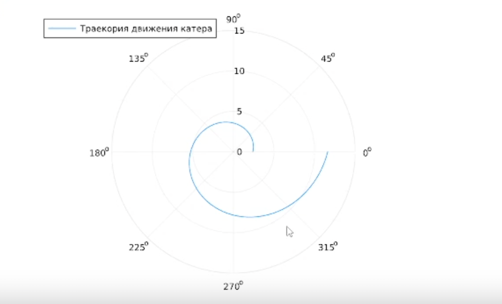
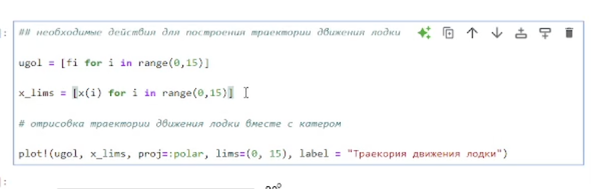
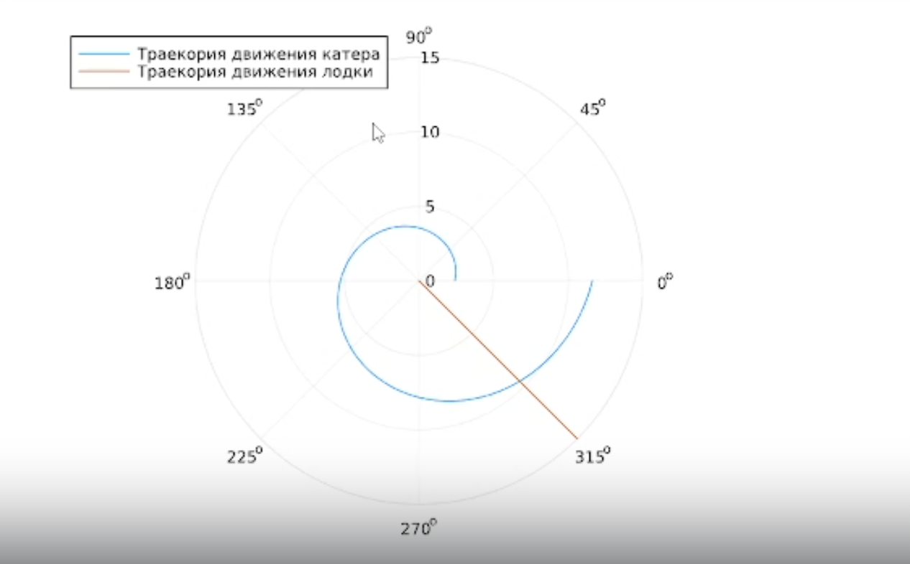
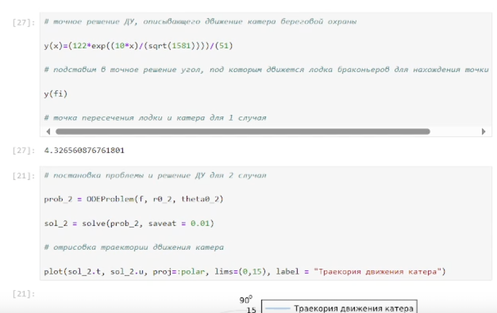
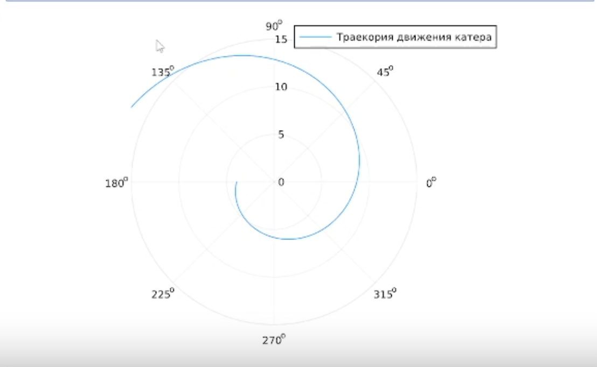
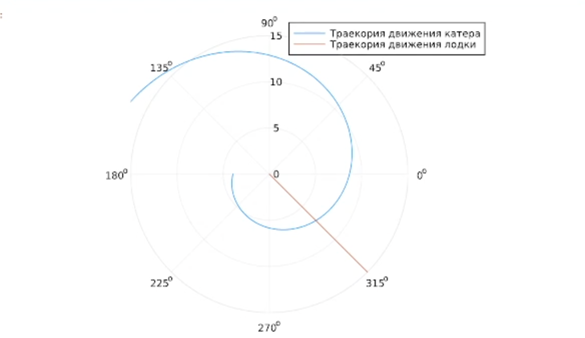
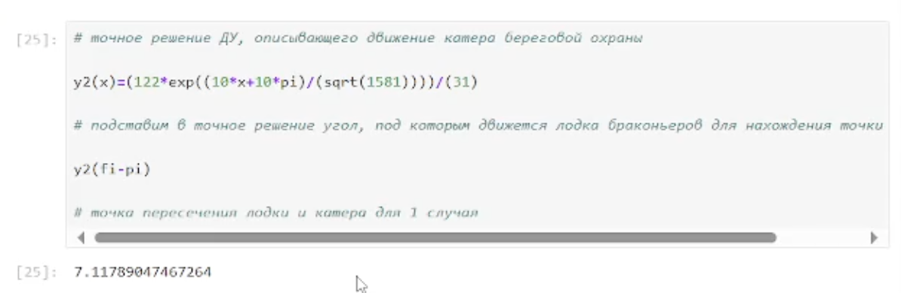

---
## Front matter
lang: ru-RU
title: Лабораторная работа 2
subtitle: Подготовка рабочего пространства
author:
  - Ланцова Я. И.
institute:
  - Российский университет дружбы народов, Москва, Россия

## i18n babel
babel-lang: russian
babel-otherlangs: english

## Formatting pdf
toc: false
toc-title: Содержание
slide_level: 2
aspectratio: 169
section-titles: true
theme: metropolis
header-includes:
 - \metroset{progressbar=frametitle,sectionpage=progressbar,numbering=fraction}
---

# Информация

## Докладчик

:::::::::::::: {.columns align=center}
::: {.column width="70%"}

  * Ланцова Яна Игоревна
  * студентка
  * Российский университет дружбы народов

:::
::::::::::::::

## Цель работы

Построить математическую модель для выбора правильной стратегии при решении примера задаче о погоне.

# Выполнение лабораторной работы

## Выполнение лабораторной работы

Формула для выбора варианта: `(113222649%70)+1` = 30 вариант.

## Выполнение лабораторной работы

$$
\dfrac{x}{v} = \dfrac{k-x}{4.1v} \text{ -- в первом случае}
$$
$$
\dfrac{x}{v} = \dfrac{k+x}{4.1v} \text{ -- во втором}
$$

Отсюда мы найдем два значения $x_1 = \dfrac{12.2}{5,1}$ и $x_2 = \dfrac{12ю2}{3,1}$, задачу будем решать для двух случаев.

## Выполнение лабораторной работы

Получаем: 

$$v_{\tau} = \sqrt{16.81v^2-v^2} = \sqrt{15.81}v$$

Из чего можно вывести:

$$
r\dfrac{d \theta}{dt} = \sqrt{15.81}v
$$

## Выполнение лабораторной работы

Решение исходной задачи сводится к решению системы из двух дифференциальных уравнений:

$$\begin{cases}
&\dfrac{dr}{dt} = v\\
&r\dfrac{d \theta}{dt} = \sqrt{15.81}v
\end{cases}$$

## Выполнение лабораторной работы

С начальными условиями для первого случая:

$$\begin{cases}
&{\theta}_0 = 0\\  \tag{1}
&r_0 = \dfrac{12.2}{5.1}
\end{cases}$$

## Выполнение лабораторной работы

Или для второго:

$$\begin{cases}
&{\theta}_0 = -\pi\\  \tag{2}
&r_0 = \dfrac{12.2}{3.1}
\end{cases}$$

## Выполнение лабораторной работы

```Julia
# расстояние от лодки до катера
k = 12.2 
# начальные условия для 1 и 2 случаев
r0 = k/5.1 
r0_2 = k/3.1 
theta0 = (0.0, 2*pi) 
theta0_2 = (-pi, pi)
# данные для движения лодки браконьеров
fi = 3*pi/4;
t = (0, 50);
```

## Выполнение лабораторной работы

```Julia
# функция, описывающая движение лодки браконьеров
x(t) = tan(fi)*t;
# функция, описывающая движение катера береговой охраны
f(r, p, t) = r/sqrt(15.81)
```

## Выполнение лабораторной работы

```Julia
# постановка проблемы и решение ДУ для 1 случая
prob = ODEProblem(f, r0, theta0)
sol = solve(prob, saveat = 0.01)
# отрисовка траектории движения катера
plot(sol.t, sol.u, proj=:polar, lims=(0, 15), label = "Траекория движения катера")
```

## Выполнение лабораторной работы

{#fig:001 width=70%}

## Выполнение лабораторной работы

{#fig:002 width=70%}

## Выполнение лабораторной работы

{#fig:003 width=70%}

## Выполнение лабораторной работы

{#fig:004 width=70%}

## Выполнение лабораторной работы

{#fig:005 width=70%}

## Выполнение лабораторной работы

```Julia

# отрисовка траектории движения лодки вместе с катером
plot!(ugol, x_lims, proj=:polar, lims=(0, 15), label = "Траекория движения лодки")
```

## Выполнение лабораторной работы

{#fig:006 width=70%}

## Выполнение лабораторной работы

{#fig:007 width=70%}

## Выводы

В процессе выполнения данной лабораторной работы я построила математическую модель для выбора правильной стратегии при решении примера задаче о погоне.
